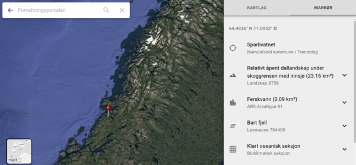

# Økologiske grunnkart

## Useful links in the project

- [Web client](https://okologiskegrunnkart.artsdatabanken.no)
- [Web client test version](https://okologiskegrunnkart.test.artsdatabanken.no)
- [Administration tool (django)](https://okologiskegrunnkartadmin.artsdatabanken.no/admin/)
- [Wms-helper to add features to sublayers](https://okologiskegrunnkartadmin.artsdatabanken.no/static/index.html)
- [Kartlag.json file](https://okologiskegrunnkart.test.artsdatabanken.no/kartlag.json)
- [Cached tiles](https://data.test.artsdatabanken.no/grunnkart/)
- [Response check](https://responssjekk.test.artsdatabanken.no/)

## Wiki

This project has a wiki, access it here:

- https://github.com/Artsdatabanken/okologiskegrunnkart/wiki

## Deployment

- manually triggered for master branch.
- See deploy.sh
- lastbalansert

## Thanks

 Thanks to BrowserStack for providing an open-source account for testing & development!

## Setting up django and kartlag file

Read more in our wiki:

- https://github.com/Artsdatabanken/okologiskegrunnkart/wiki/%C3%85-sette-opp-django-kartlag.js-%5Butvikling%5D

## Start app in localhost

Follow these steps:

- Run `npm install`
- Run `npm start`
- Get the example map data `kartlag.json` from `https://okologiskegrunnkart.test.artsdatabanken.no/kartlag.json`. Save this file in the `public` folder (there exists already a `kartlag_preview.json` file).

## Run unit-tests locally

Unit tests in Økologiske Grunnkart use `jest` and `react testing library`.

Unit-tests are run with the following command: `npm run test`.

## Run integration-tests locally with Cypress

Integration-tests can be run locally in each of the environments Økologiske Grunnkart uses: `dev` (localhost), `test`, and `prod`.
Furthermore, integration-tests can be run locally in three different ways: `interactive`, `in the background`, and `in parallel in the background`.

Run one of the following commands for interactive tests:

- Interactive tests in dev: `npm run open`
- Interactive tests in test: `npm run open:test`
- Interactive tests in prod: `npm run open:prod`

Run one of the following commands for tests in the background:

- Background tests in dev: `npm run e2e`
- Background tests in test: `npm run e2e:test`
- Background tests in prod: `npm run e2e:prod`

Integration tests are divided in three groups which can be run separatedly. It requires opening three consoles and running one test group in each of them. This can be easily automated by doing this operation in a script or .bat file. Please note that, even though tests can be run in parallel on a single machine this way, it may require a significant amount of resources. More info at `https://docs.cypress.io/`.

- Parallel tests in dev: `npm run group1`, `npm run group2`, `npm run group3`
- Parallel tests in test: `npm run group1:test`, `npm run group2:test`, `npm run group3:test`
- Parallel tests in prod: `npm run group1:prod`, `npm run group2:prod`, `npm run group3:prod`

## Eslint skaper seg

Slett wms-assistent/node_modules/eslint-config-react-app
  // eslint-disable-next-line
  const layer = (doc && doc.underlag && doc.underlag[selectedLayerIndex]) || {};
