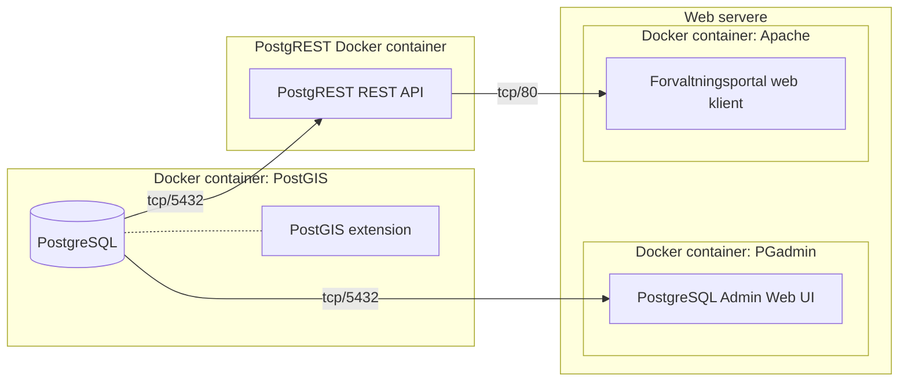

## Komponenter



## Connecting to PostgreSQL

### Password file

```bash
echo 172.17.0.2:5432:postgres:postgres:veldighemmelig >~/.pgpass
chmod 0600 ~/.pgpass
```

### Command line

```bash
psql -h 172.17.0.2 -U postgres -d postgres
```

## GDAL

https://github.com/OSGeo/gdal/tree/master/gdal/docker
docker run --rm -v /home:/home osgeo/gdal:alpine-small-latest gdalinfo \$PWD/kommune_4326.geojson

## Connect to docker

docker run -it --link forvaltningsportal-postgres:postgres --rm postgres \
 sh -c 'exec psql -h "$POSTGRES_PORT_5432_TCP_ADDR" -p "$POSTGRES_PORT_5432_TCP_PORT" -U postgres'

docker exec -it forvaltningsportal-postgres /bin/bash

## Database client tools

### PSPG

sudo apt install pspg

## PGAdmin

```bash
docker run -p 80:80 \
    -e 'PGADMIN_DEFAULT_EMAIL=user@domain.com' \
    -e 'PGADMIN_DEFAULT_PASSWORD=thesearenottheyodasyouarelookingfor' \
    -d dpage/pgadmin4
```

http://172.17.0.3/login?next=%2F

## Run script

```bash
psql -h 172.17.0.2 -U postgres -d postgres -a -v ON_ERROR_STOP=1 -f 001_schema.sql
```

## Kommuner

### GitHub kommune-kart

```bash
cd temp
wget https://github.com/Artsdatabanken/kommune-kart/raw/master/kommune_4326.geojson
docker run --rm -v /home:/home osgeo/gdal:alpine-small-latest ogr2ogr -f "PostgreSQL" PG:"dbname=postgres schema=import host=172.17.0.2 user=postgres password=veldighemmelig" $PWD/kommune_4326.geojson -nln kommune -overwrite
```

### PostGIS backup

```bash
https://nedlasting.geonorge.no/geonorge/Basisdata/Kommuner/POSTGIS/Basisdata_0000_Norge_25833_Kommuner_PostGIS.zip
docker exec -it forvaltningsportal-postgres pg_restore -h localhost --dbname=import -U postgres $PWD/Basisdata_0000_Norge_25833_Kommuner_PostGIS.backup
```

### GeoJSON

```bash
wget https://nedlasting.geonorge.no/geonorge/Basisdata/Kommuner/GeoJSON/Basisdata_0000_Norge_25833_Kommuner_GEOJSON.zip
unzip Basisdata_0000_Norge_25833_Kommuner_GEOJSON.zip
docker run --rm -v /home:/home osgeo/gdal:alpine-small-latest ogr2ogr -f "PostgreSQL" PG:"dbname=import host=172.17.0.2 user=postgres password=veldighemmelig" $PWD/Basisdata_0000_Norge_25833_Kommuner_GEOJSON.geojson -nln kommune -overwrite
```

### FGDB

```bash
wget https://nedlasting.geonorge.no/geonorge/Basisdata/Kommuner/FGDB/Basisdata_0000_Norge_25833_Kommuner_FGDB.zip
unzip Basisdata_0000_Norge_25833_Kommuner_FGDB.zip
docker run --rm -v /home:/home osgeo/gdal:alpine-small-latest ogr2ogr -f "PostgreSQL" PG:"dbname=import host=172.17.0.2 user=postgres password=veldighemmelig" $PWD/Basisdata_0000_Norge_25833_Kommuner_FGDB.gdb/ -lco SCHEMA=import -nln kommune -overwrite
```

## Naturvernområder

```bash
wget https://github.com/Artsdatabanken/naturvern-kart/raw/master/polygon.4326.geojson
docker run --rm -v /home:/home osgeo/gdal:alpine-small-latest ogr2ogr -f "PostgreSQL" PG:"dbname=postgres host=172.17.0.2 user=postgres password=veldighemmelig" $PWD/polygon.4326.geojson -lco SCHEMA=import -nln naturvernområde -overwrite

```

## Postgrest

```sql
CREATE FUNCTION add_them(a integer, b integer)
RETURNS integer AS \$\$
SELECT a + b;
$$

CREATE FUNCTION punkt(lng decimal, lat decimal)
RETURNS kart AS $$
SELECT * FROM kart
WHERE ST_Contains(geom, ST_SetSRID(ST_Point(13.9203608,65.154592),4326))
$$ LANGUAGE SQL IMMUTABLE;

```

curl "http://localhost:3000/rpc/add_them?a=2&b=9"

docker restart postgrest
curl --data "a=2&b=3" http://localhost:3000/rpc/add_them

$$
$$

curl "http://localhost:3000/rpc/punkt?a=2&b=9"
