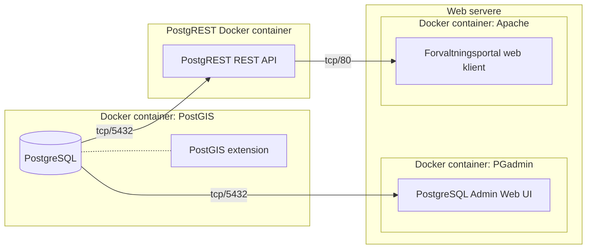

## Komponenter



## Connecting to PostgreSQL

### Password file

```bash
echo 172.17.0.2:5432:postgres:postgres:veldighemmelig >~/.pgpass
chmod 0600 ~/.pgpass
```

### Command line

```bash
psql -h 172.17.0.2 -U postgres -d postgres
```

## GDAL

https://github.com/OSGeo/gdal/tree/master/gdal/docker
docker run --rm -v /home:/home osgeo/gdal:alpine-small-latest gdalinfo \$PWD/kommune_4326.geojson

## Connect to docker

docker run -it --link forvaltningsportal-postgres:postgres --rm postgres \
 sh -c 'exec psql -h "$POSTGRES_PORT_5432_TCP_ADDR" -p "$POSTGRES_PORT_5432_TCP_PORT" -U postgres'

docker exec -it forvaltningsportal-postgres /bin/bash

## Database client tools

### PSPG

sudo apt install pspg

## PGAdmin

```bash
docker run -p 80:80 \
    -e 'PGADMIN_DEFAULT_EMAIL=user@domain.com' \
    -e 'PGADMIN_DEFAULT_PASSWORD=thesearenottheyodasyouarelookingfor' \
    -d dpage/pgadmin4
```

http://172.17.0.3/login?next=%2F

## Run script

```bash
psql -h 172.17.0.2 -U postgres -d postgres -a -v ON_ERROR_STOP=1 -f 001_schema.sql
```

## Fylker

### GML (todo attributes)

```bash
docker run --rm -v /home:/home osgeo/gdal:alpine-small-latest ogr2ogr -f "PostgreSQL" PG:"dbname=postgres host=172.17.0.2 user=postgres password=veldighemmelig" /home/b/src/adb/forvaltningsportal/database/temp/Basisdata_0000_Norge_4258_Fylker_GML.gml  -lco SCHEMA=import -nln fylke -lco OVERWRITE=YES
```

### GitHub kommune-kart

```bash
cd temp
wget https://github.com/Artsdatabanken/kommune-kart/raw/master/fylke_4326.geojson

docker run --rm -v /home:/home osgeo/gdal:alpine-small-latest ogr2ogr -f "PostgreSQL" PG:"dbname=postgres host=172.17.0.2 user=postgres password=veldighemmelig" $PWD/fylke_4326.geojson -lco SCHEMA=import -nln fylke -lco OVERWRITE=yes

docker run --rm -v /home:/home osgeo/gdal:alpine-small-latest ogr2ogr -f "PostgreSQL" PG:"dbname=postgres host=172.17.0.18 user=postgres password=veldighemmelig" $PWD/fylke_4326.geojson -lco SCHEMA=import -nln fylke -lco OVERWRITE=yes

psql -h 172.17.0.18 -U postgres

```

## Kommuner

### GitHub kommune-kart

```bash
cd temp
wget https://github.com/Artsdatabanken/kommune-kart/raw/master/kommune_4326.geojson

docker run --rm -v /home:/home osgeo/gdal:alpine-small-latest ogr2ogr -f "PostgreSQL" PG:"dbname=postgres host=172.17.0.2 user=postgres password=veldighemmelig" $PWD/kommune_4326.geojson -lco SCHEMA=import -nln kommune -nlt MULTIPOLYGON -lco OVERWRITE=yes -overwrite

docker run --rm -v /home:/home osgeo/gdal:alpine-small-latest ogr2ogr -f "PostgreSQL" PG:"dbname=postgres host=172.17.0.27 user=postgres password=veldighemmelig" $PWD/kommune_4326.geojson -lco SCHEMA=import -nln kommune -lco OVERWRITE=yes -overwrite
```

### PostGIS backup

```bash
https://nedlasting.geonorge.no/geonorge/Basisdata/Kommuner/POSTGIS/Basisdata_0000_Norge_25833_Kommuner_PostGIS.zip
docker exec -it forvaltningsportal-postgres pg_restore -h localhost --dbname=import -U postgres $PWD/Basisdata_0000_Norge_25833_Kommuner_PostGIS.backup
```

### GeoJSON

```bash
wget https://nedlasting.geonorge.no/geonorge/Basisdata/Kommuner/GeoJSON/Basisdata_0000_Norge_25833_Kommuner_GEOJSON.zip
unzip Basisdata_0000_Norge_25833_Kommuner_GEOJSON.zip
docker run --rm -v /home:/home osgeo/gdal:alpine-small-latest ogr2ogr -f "PostgreSQL" PG:"dbname=import host=172.17.0.2 user=postgres password=veldighemmelig" $PWD/Basisdata_0000_Norge_25833_Kommuner_GEOJSON.geojson -nln kommune -overwrite
```

### FGDB

```bash
wget https://nedlasting.geonorge.no/geonorge/Basisdata/Kommuner/FGDB/Basisdata_0000_Norge_25833_Kommuner_FGDB.zip
unzip Basisdata_0000_Norge_25833_Kommuner_FGDB.zip
docker run --rm -v /home:/home osgeo/gdal:alpine-small-latest ogr2ogr -f "PostgreSQL" PG:"dbname=import host=172.17.0.2 user=postgres password=veldighemmelig" $PWD/Basisdata_0000_Norge_25833_Kommuner_FGDB.gdb/ -lco SCHEMA=import -nln kommune -overwrite
```

## Naturvernområder

```bash
wget https://github.com/Artsdatabanken/naturvern-kart/raw/master/polygon.4326.geojson
docker run --rm -v /home:/home osgeo/gdal:alpine-small-latest ogr2ogr -f "PostgreSQL" PG:"dbname=postgres host=172.17.0.24 user=postgres password=veldighemmelig" $PWD/polygon.4326.geojson -lco SCHEMA=import -nln naturvernområde -overwrite

```

## Natursystem

```bash
docker run --rm -v /home:/home osgeo/gdal:alpine-small-latest ogr2ogr -f GeoJSON $PWD/nat.json \
  "PG:host=172.17.0.23 user=$PGUSER password=$PGPASSWORD" \
  -sql "select geom, data from kart a where datasettkode='NAT'"

cat nat.json | sed -r "s/data\": \{ \"type/koder/g" >nat2.json
cat nat2.json | sed -r "s/\], \"variabel\": \[/,/g" >nat3.json
cat nat3.json | sed -r "s/\, null \] \} \}/]}/g" >nat4.json
cat nat4.json | sed -r "s/\" \] \} \}/\"]}/g" >natok.json
cat natok.json | sed -r "s/\{ \"type/\n\{ \"type/g" >natok2.json
cat natok.json | sed -r "s/\,$//g" >natok2.json


\COPY (SELECT ROW_TO_JSON(t) FROM (SELECT * FROM import_nin.kode_ulkm) t) TO '/home/grunnkart/bak/kode_ulkm.geojsonl';
\COPY (SELECT ROW_TO_JSON(t) FROM (SELECT * FROM import_nin.variabler5k) t) TO '/home/grunnkart/bak/variabler5k.geojsonl';
\COPY (SELECT ROW_TO_JSON(t) FROM (SELECT * FROM import_nin.variabler20k) t) TO '/home/grunnkart/bak/variabler20k.geojsonl';
\COPY (SELECT ROW_TO_JSON(t) FROM (SELECT * FROM import_nin.variablernaturtyper) t) TO '/home/grunnkart/bak/variablernaturtyper.geojsonl';
\COPY (SELECT ROW_TO_JSON(t) FROM (SELECT * FROM import_nin.områdernt) t) TO '/home/grunnkart/bak/områdernt.geojsonl';
\COPY (SELECT ROW_TO_JSON(t) FROM (SELECT * FROM import_nin.kobling_nt_bv) t) TO '/home/grunnkart/bak/kobling_nt_bv.geojsonl';
\COPY (SELECT ROW_TO_JSON(t) FROM (SELECT * FROM import_nin.kode_kartleggingsenheter) t) TO '/home/grunnkart/bak/kode_kartleggingsenheter.geojsonl';
\COPY (SELECT ROW_TO_JSON(t) FROM (SELECT * FROM import_nin.kode_variabler) t) TO '/home/grunnkart/bak/kode_variabler.geojsonl';
\COPY (SELECT ROW_TO_JSON(t) FROM (SELECT * FROM import_nin.områder20k) t) TO '/home/grunnkart/bak/områder20k.geojsonl';


 import_nin         | brukere                  | table | postgres
 import_nin         | program                  | table | postgres
 import_nin         | prosjekt_kartleggere     | table | postgres
 import_nin         | prosjekt_kontrollører    | table | postgres
 import_nin         | prosjekter               | table | postgres
 import_nin         | kartleggingsenheter20k   | table | postgres
 import_nin         | kartleggingsenheter5k    | table | postgres
 import_nin         | kartleggingsenheternt    | table | postgres
 import_nin         | kobling_nt_bv            | table | postgres
 import_nin         | kode_kartleggingsenheter | table | postgres
 import_nin         | kode_naturtyper          | table | postgres
 import_nin         | kode_ulkm                | table | postgres
 import_nin         | kode_variabler           | table | postgres
 import_nin         | områder20k               | table | postgres
 import_nin         | områder5k                | table | postgres
 import_nin         | områdernt                | table | postgres
 import_nin         | variabler20k             | table | postgres
 import_nin         | variabler5k              | table | postgres
 import_nin         | variablernaturtyper      | table | postgres


```

## Postgrest

```sql

CREATE FUNCTION punkt(lng decimal, lat decimal)
RETURNS kart AS $$
SELECT * FROM kart WHERE ST_Contains(geom, ST_SetSRID(ST_Point(8.06163937252387,63.4512403811651),4326))
$$ LANGUAGE SQL IMMUTABLE;

-- FUNCTION: public.punkt(numeric, numeric)

-- DROP FUNCTION public.punkt(numeric, numeric);

CREATE OR REPLACE FUNCTION punkt(lng numeric,	lat numeric)
RETURNS SETOF kart AS $$
SELECT *--datasettkode AS kartlag, navn, data, geom, bbox
FROM kart
WHERE ST_Contains(geom, ST_SetSRID(ST_Point(lng,lat),4326))
$$ LANGUAGE SQL IMMUTABLE;


CREATE OR REPLACE FUNCTION oppslag(q varchar)
RETURNS SETOF kart AS $$
SELECT *--datasettkode AS kartlag, navn, geom, bbox
FROM kart
WHERE kart.navn LIKE q
$$ LANGUAGE SQL IMMUTABLE;

-- Fylke fra nummer
CREATE OR REPLACE FUNCTION fylke(nummer varchar)
RETURNS SETOF kart AS $$
SELECT *
FROM kart
WHERE datasettkode='FYL'
AND id LIKE NUMMER
$$ LANGUAGE SQL IMMUTABLE;

-- Kommune fra nummer
CREATE OR REPLACE FUNCTION kommune(nummer varchar)
RETURNS SETOF kart AS $$
SELECT *
FROM kart
WHERE datasettkode='KOM'
AND id LIKE NUMMER
$$ LANGUAGE SQL IMMUTABLE;

CREATE OR REPLACE FUNCTION public.arealstatistikk(kartlag text, wkt text)
 RETURNS json
AS $$
SELECT json_object_agg(ds.datasettkode,
   coalesce((
     SELECT json_agg(json_build_object('kode', id, 'navn', navn,
      'km2', km2)::jsonb)
 FROM (
     SELECT j.id,  j.navn, SUM(ST_Area(ST_Transform(ST_Intersection(geom, ST_GeomFromEWKT(wkt)),25833))/1000000) as km2
     FROM kart as j
     WHERE j.datasettkode=ds.datasettkode
     AND ST_Intersects(geom, ST_GeomFromEWKT(wkt))
     AND ST_Area(ST_Transform(ST_Intersection(geom, ST_GeomFromEWKT(wkt)),25833))>100 -- 10 m²
     GROUP BY j.id, j.navn
    ) x ))) as json
FROM datasett ds
WHERE datasettkode = ANY(regexp_split_to_array(kartlag,','));
$$ LANGUAGE SQL IMMUTABLE;


curl --header "Content-Type: application/json" \
  --request POST \
  --data '{"kartlag":"FYL", "wkt": "POLYGON ((10 60,10 65,20 60,10 60))"}' \
  https://forvaltningsportalapi.test.artsdatabanken.no/rpc/arealstatistikk_wkt

https://forvaltningsportalapi.test.artsdatabanken.no/rpc/arealstatistikk2?kartlag=KOM,FYL&koordinater=62%2010,62%2011,63%2010.51,62%2010

https://forvaltningsportalapi.test.artsdatabanken.no/rpc/linjestatistikk?kartlag=KOM,FYL&koordinater=62%2010,62%2011,63.1%2010.51,62%2010

-- Lengde langs linje
CREATE OR REPLACE FUNCTION public.linjestatistikk(kartlag varchar, koordinater varchar)
RETURNS JSON AS $$
SELECT json_object_agg(ds.datasettkode,
   coalesce((
     SELECT json_agg(
      json_build_object('kode', j.id, 'navn', j.navn,
      'km', ST_Length(ST_Transform(ST_Intersection(geom, ST_FlipCoordinates(ST_GeomFromText(CONCAT('LINESTRING(',koordinater,')'),4326))),25833))/1000000)::jsonb)
     FROM kart as j WHERE j.datasettkode=ds.datasettkode
     AND ST_Intersects(geom, ST_FlipCoordinates(ST_GeomFromText(CONCAT('LINESTRING(',koordinater,')'),4326)))
    ))) as json
FROM datasett ds
WHERE datasettkode = ANY(regexp_split_to_array(kartlag,','))
$$ LANGUAGE SQL IMMUTABLE;

```

docker restart postgrest

curl "http://localhost:3000/rpc/punkt?a=2&b=9"
https://forvaltningsportalapi.test.artsdatabanken.no/rpc/oppslag?q=Nord%
